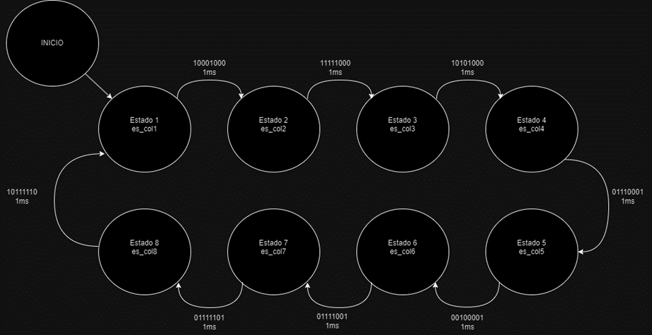

# PROYECTO #2 MICROPROCESADORES

## Diseño de la máquina de estados

Partiendo del axioma conocido de las máquinas de estados de Mealy y Moore vistos en clase, se escoge el modelo de Moore para la implementación de la máquina de estados correspondiente al proyecto dos; debido a que resulta más cómodo la actualización de los estados dentro del estado en sí y no en las conexiones intermedias. Se elige la imagen a representar en la matriz (figura 1). El diagrama del modelo a implementar con 8 estados, cada uno correspondiente a una columna de la matriz 8x8 y sus salidas, puede verse en la figura 2.

Figura 1

figura 2
### Configuración de la memoria
Se escoge el puerto B (10-17) para las columnas y el puerto C (8-15) para las filas de la siguiente manera:

| PUERTO | INICIO-FIN           |
|--------|----------------------|
| B      | 0x4004A028-0x4004A044 |
| C      | 0x4004B020-0x4004B03C |

Con el fin de reducir el número de puertos necesarios para llevar a cabo este ejercicio, se elige una técnica de multiplexación en las filas, en la cual, gracias a la persistencia ocular de los seres humanos, no es necesario mantener encendidos todos los LEDs al mismo tiempo. Si se utiliza un período de encendido y apagado de unos pocos milisegundos se aprecia como una imagen ante el ojo humano. 

La imagen a visualizar se almacena en la memoria flash para luego ser transferida a la RAM. De esta manera la imagen puede cambiarse a voluntad. 

